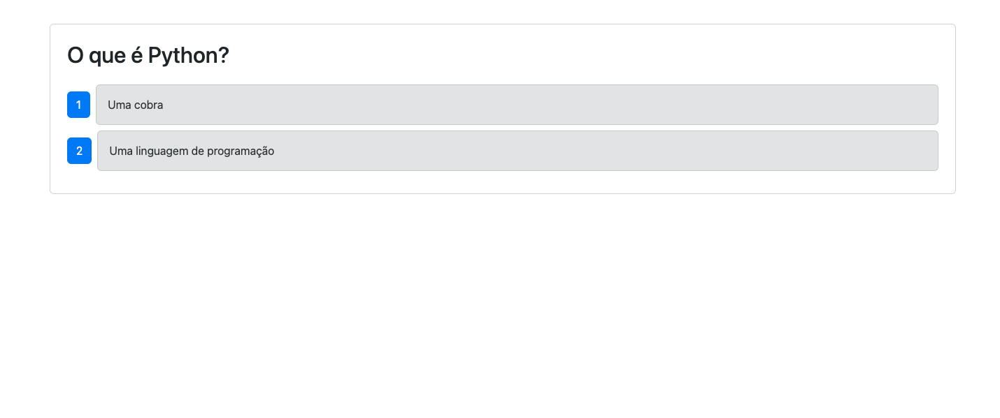
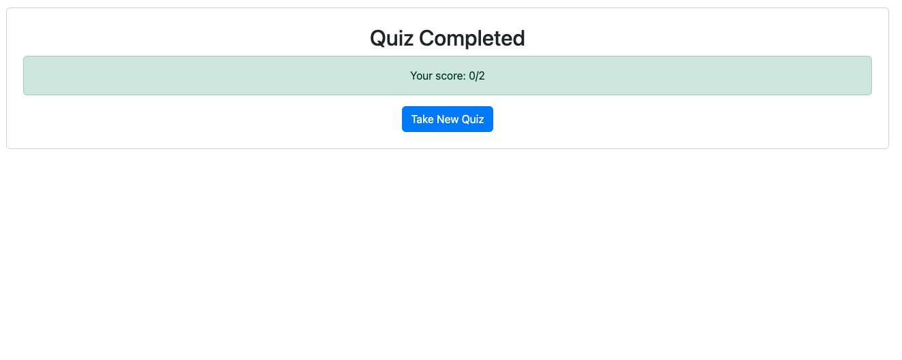

# CI/CD Pipeline with GitHub Actions and Render Deployment

## Description

This project demonstrates a basic **CI/CD pipeline** setup using **GitHub Actions** to automate testing and deployment for a full-stack application.

- When a **pull request** is made to the `develop` branch, **Cypress component tests** are automatically run.
- When changes are merged into the `main` branch, the application is automatically **deployed to Render** using a deploy hook.

## Technologies Used

- GitHub Actions
- Cypress (for component testing)
- Render (for deployment)
- Node.js / Express / MongoDB (application stack)

## Screenshots

| Home Screen |

  

| Quiz Question |
 

  

| Final Result |
 

  

## Deployed Application

[Film_Tracking_App](https://ci-cd-film-tracking-app.onrender.com)

## Repo Link

- [CI/CD_Pipeline][(https://github.com/ThayRibeiro0/film-tracking-app](https://github.com/ThayRibeiro0/CI_CD_Film_Tracking_App))

- [Gist][https://gist.github.com/ThayRibeiro0/ac189737f91a768ba3fb362fd6600786](https://gist.github.com/ThayRibeiro0/ac189737f91a768ba3fb362fd6600786)

## Notes

> This project is part of the **Module 20 Challenge** for the UCI Full-Stack Bootcamp.  
> Code based on Film_tracker of mini_project.
> Others references:
  - https://www.youtube.com/watch?v=YLtlz88zrLg
  - https://www.youtube.com/shorts/Kq28yBigDYw
  - https://www.youtube.com/watch?v=ylEy4eLdhFs

## License

This project is licensed under the MIT License.
